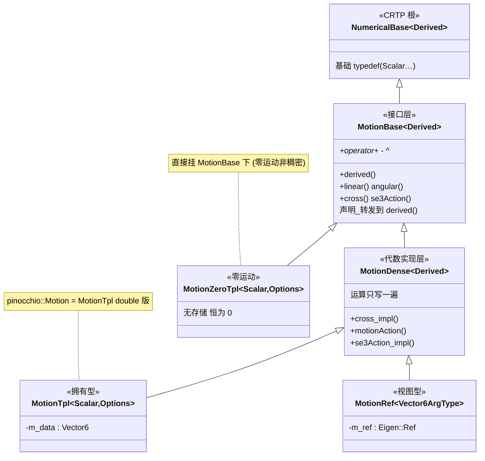
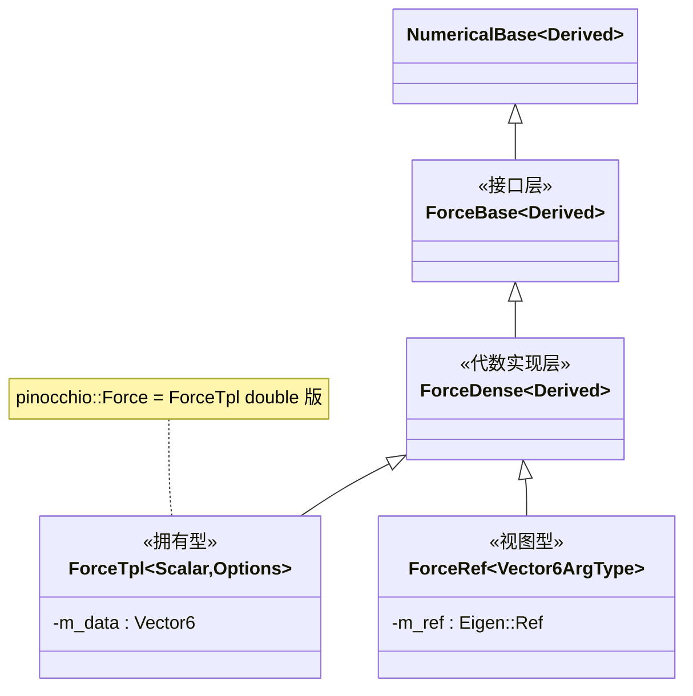
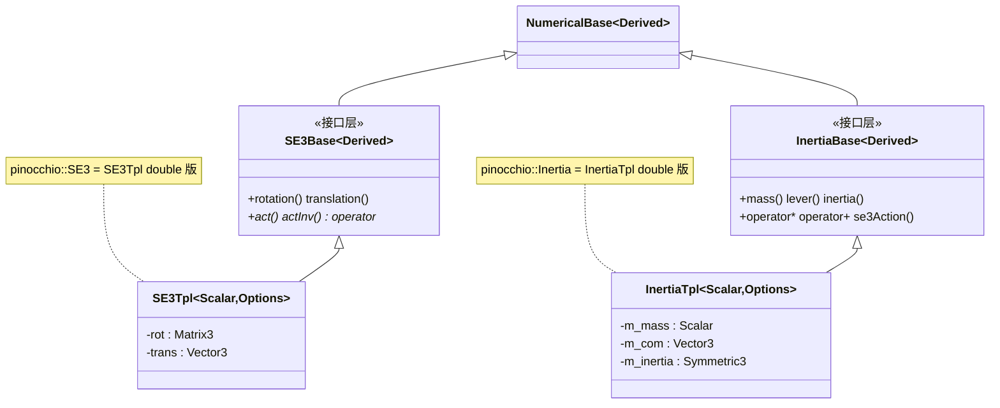
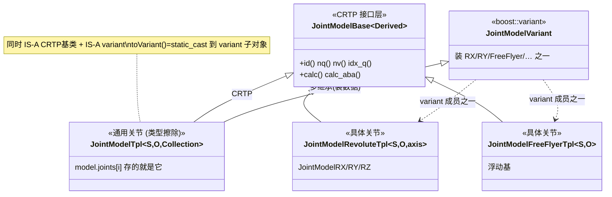

# Pinocchio 核心类的继承结构（UML）

> 用标准 UML（mermaid `classDiagram`）汇总 Pinocchio 各核心类型家族的**继承关系**。
> 每个家族配：UML 图 + ASCII 备用图 + 关键说明。
>
> - 各类型的**运算**见 [docs/空间代数运算解析.md](空间代数运算解析.md)；
> - **机制/模板**见 [docs/源码解析.md](源码解析.md) 与 [docs/C++语法技巧.md](C++语法技巧.md)；
> - **本文档只画"类之间怎么继承"**。持续追加。

---

## 通用说明：CRTP 自引用怎么读

Pinocchio 的类几乎全用 **CRTP**（见 [C++语法技巧 §4](C++语法技巧.md)）：**派生类把"自己"作为模板参数传给基类**。

```cpp
class MotionTpl<S,O> : public MotionDense< MotionTpl<S,O> >   // 基类被"自己"实例化
```

所以下面 UML 里画的普通泛化箭头（`基类 <|-- 派生类`），实际都是"**基类 = `XxxBase<派生类自己>`**"。
根类 `NumericalBase<Derived>` 只提供 `Scalar` 等基础 typedef，是所有 spatial 类型的 CRTP 根。

---

## 目录

1. [Motion 家族](#1-motion-家族)
2. [Force 家族（与 Motion 同构）](#2-force-家族与-motion-同构)
3. [SE3 / Inertia（简单：Base + Tpl）](#3-se3--inertia简单base--tpl)
4. [Joint Model / Data 家族（CRTP + variant 多继承）](#4-joint-model--data-家族crtp--variant-多继承)

---

## 1. Motion 家族

**文件**：`spatial/motion-{base,dense,tpl,ref,zero}.hxx`



```
NumericalBase<Derived>
        ▲
MotionBase<Derived>                    接口层：声明 API，转发到 derived()
        ▲
MotionDense<Derived>                   ★代数实现层：运算只写一遍
        ▲                    ▲
MotionTpl<Scalar,Options>   MotionRef<Vector6ArgType>
  -m_data: Vector6            -m_ref: Eigen::Ref
  （拥有数据）                 （零拷贝视图；MotionRef<const V6> 只读偏特化）

MotionZeroTpl<Scalar,Options>          直接挂 MotionBase 下（零运动，无存储）
```

**三层职责**：`MotionBase`=接口层（转发）｜`MotionDense`=**代数实现层**（cross/se3Action/±/^ 只写一遍）｜
`MotionTpl`/`MotionRef`=**两种存储后端**（拥有数据 / 引用外部内存，见 [空间代数解析 §1.4](空间代数运算解析.md)）。
两个旁支：`MotionZeroTpl` 直接继承 `MotionBase`（跳过 Dense，零运动可特化更高效）；`MotionRef<const V6>` 是只读偏特化。

---

## 2. Force 家族（与 Motion 同构）

**文件**：`spatial/force-{base,dense,tpl,ref}.hxx`。结构与 Motion **完全一样**，把 Motion 换成 Force 即可。



> `f`=linear、`τ`=angular。`Force` 是 `Motion` 的**对偶**（功率 $\phi^\top\nu$ 不变），但类结构一模一样。

---

## 3. SE3 / Inertia（简单：Base + Tpl）

**文件**：`spatial/se3-{base,tpl}.hxx`、`spatial/inertia.hxx`。没有 Dense/Ref 分层，只有"接口层 + 具体实现"两层。



```
NumericalBase<Derived>          NumericalBase<Derived>
      ▲                               ▲
SE3Base<Derived>                InertiaBase<Derived>
      ▲                               ▲
SE3Tpl<Scalar,Options>          InertiaTpl<Scalar,Options>
  -rot: Matrix3                   -m_mass / m_com / m_inertia(Symmetric3)
  -trans: Vector3
```

---

## 4. Joint Model / Data 家族（CRTP + variant 多继承）

**文件**：`multibody/joint/joint-generic.hxx`、`joint-model-base.hxx`、各 `joint-*.hxx`。
这是**最复杂**的一族——通用关节 `JointModelTpl` **同时继承 CRTP 基类和 variant**（见 [源码解析条目 4](源码解析.md)）。



```
JointModelBase<Derived>                       ← CRTP 接口层（id/nq/nv/calc…）
   ▲          ▲                    ▲
   │(CRTP)    │                    │
JointModelTpl<S,O,Collection>   JointModelRX   JointModelFreeFlyer …（具体关节）
   ▲  也继承                          ▲__________________▲
   │                                        装进
JointCollection::JointModelVariant = boost::variant<JointModelRX, …, FreeFlyer>
```

**关键：`JointModelTpl` 的双重身份**
- 继承 `JointModelBase<JointModelTpl>`（CRTP）→ 有统一接口、能整齐放进 `std::vector<JointModel>`；
- 继承 `JointCollection::JointModelVariant`（boost::variant）→ 能装任意具体关节、能被 `apply_visitor` 分派。

具体关节（`JointModelRX`、`JointModelFreeFlyer`…）各自也是 `JointModelBase<自己>`（CRTP），并作为 variant 的成员类型。
**Data 侧完全对称**：`JointDataBase / JointDataTpl / JointDataVariant / JointDataRX…`，结构同上图。

> 详细机制（装箱/拆箱、apply_visitor 分派）见 [源码解析条目 4/5/9](源码解析.md)。

---

## 一句话定位

> 本文档是 Pinocchio 的**类继承地图**：spatial 四族（Motion/Force 三层带存储后端、SE3/Inertia 两层）都以
> `NumericalBase` 为 CRTP 根；Joint 族最特殊——`JointModelTpl` 同时继承 CRTP 基类与 variant。看类结构先来这里。
